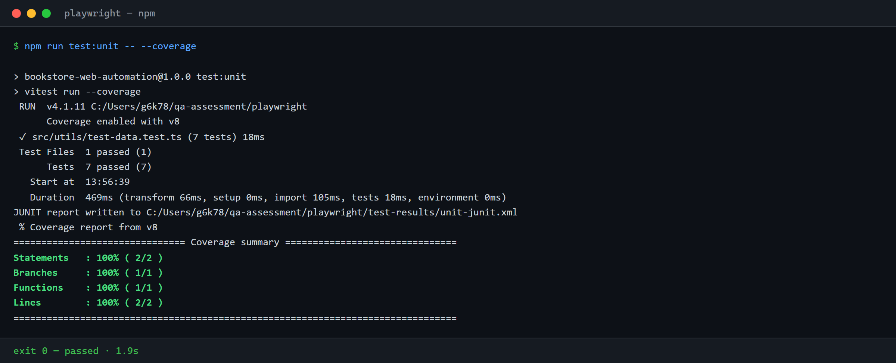
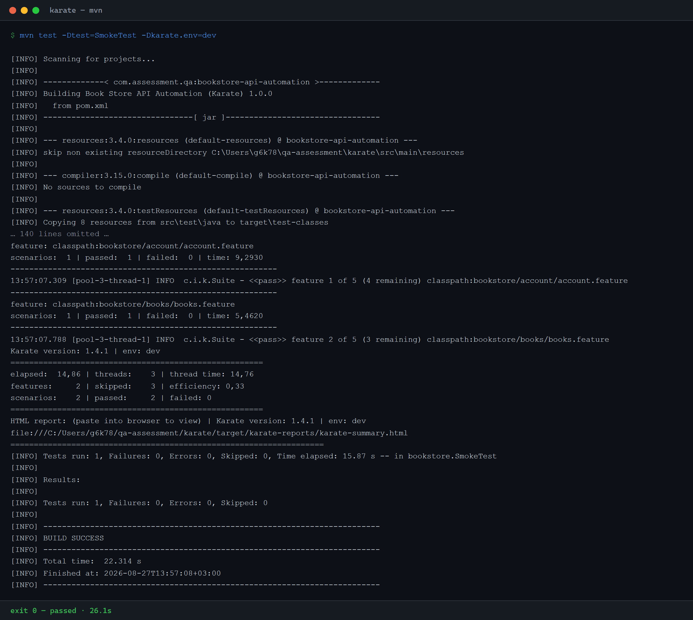
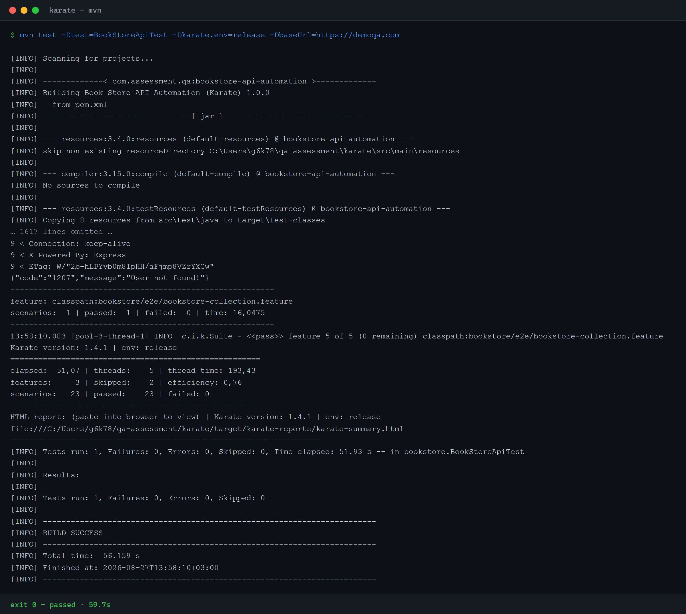
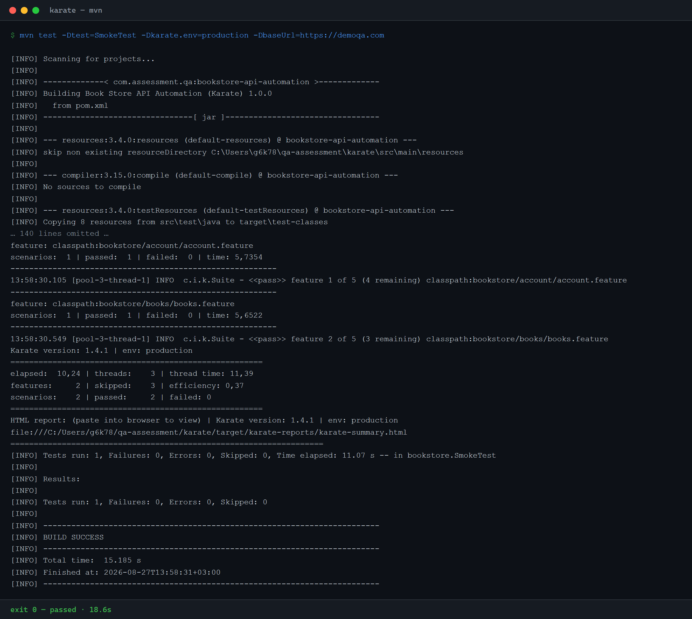
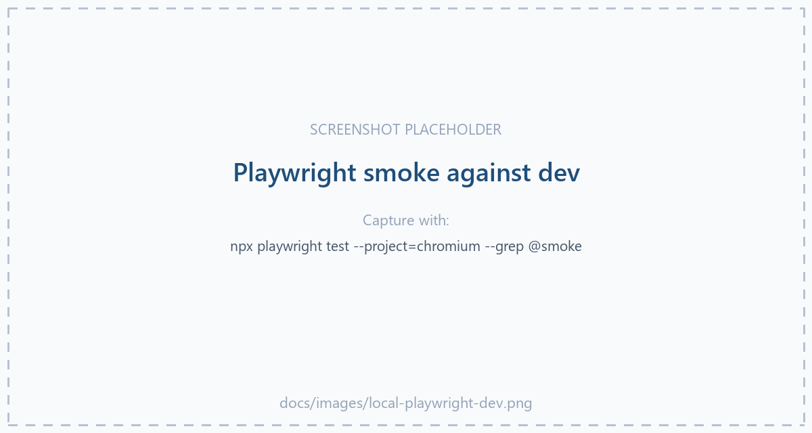
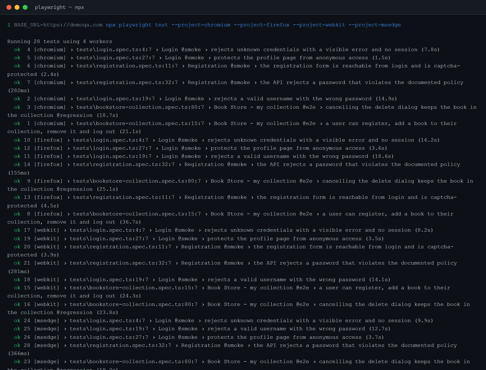
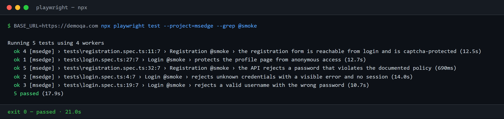
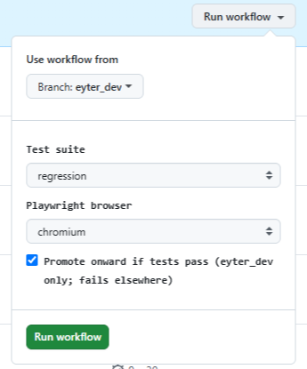
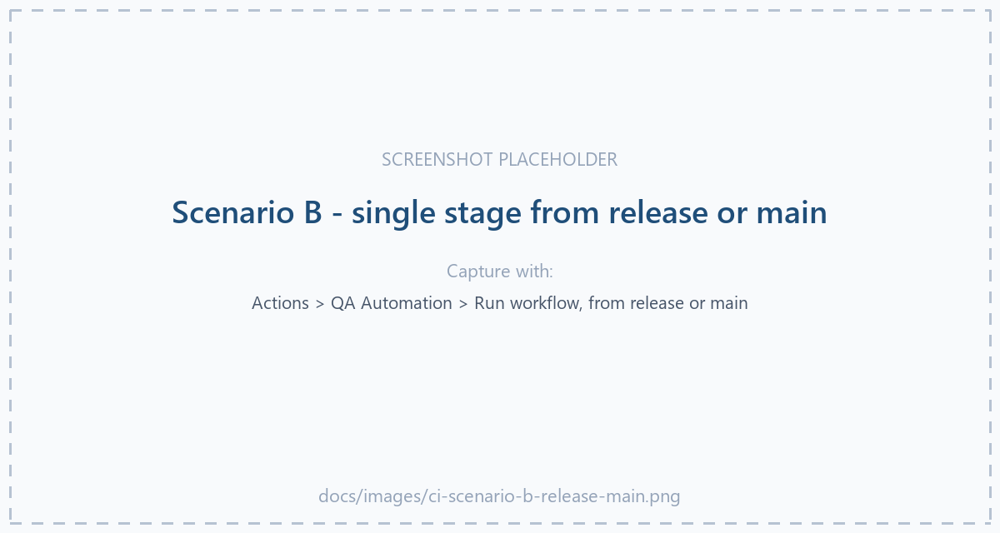
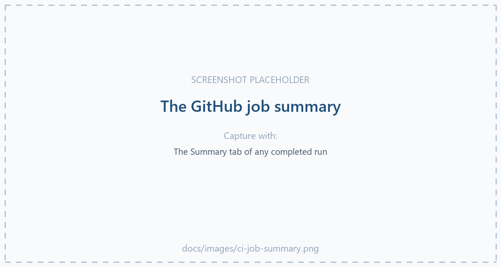

# Senior QA Engineer — Assessment

Written submission and working automation for the
[demoqa.com Book Store](https://demoqa.com/books) application.

## The submission

| Deliverable | Where |
|---|---|
| **Written document** — all questions, Parts 1–3, plus test plan and defect log | [Senior_QA_Engineer_Assessment.md](Senior_QA_Engineer_Assessment.md) |
| Same document, formatted — open in a browser, print to PDF | [docs/assessment.html](docs/assessment.html) |
| Web automation (Playwright + TypeScript) | [`playwright/`](playwright/) |
| API automation (Karate + Java) | [`karate/`](karate/) |

**The automated flow:** register → login → search & add a book → view the collection →
delete the book → logout. Automated at both layers.

## Test results

Both suites were executed against the live site while this repository was written.

```
Playwright   7 passed (chromium)
Karate      23 scenarios passed, 0 failed
```

Building them surfaced **11 defects and observations** in the application under test,
documented with reproduction steps in Appendix B of the assessment document.

## Testing manual

<!-- testing-manual:start -->

### 1. Testing architecture

Three layers, run in a strict sequence. Each is cheaper and more certain than the
one after it, so the pipeline learns the cheapest thing first and stops as soon as
it knows enough.

| Layer | Tool | Scope | Needs a target URL? | Fails the stage below it |
|---|---|---|---|---|
| **Unit** | Vitest | Pure logic in `playwright/src` — no browser, no network | No | Skips API **and** UI |
| **API** | Karate (Java 17 + Maven) | Book Store REST contract, per scenario | Yes | Skips UI |
| **UI** | Playwright | Browser journeys, one leg per browser | Yes | — |

```
0. unit (Vitest)  →  api (Karate)  →  ui (Playwright, one leg per browser)
```

**Why unit tests run once, not per environment.** Unit tests assert pure logic —
they never open a browser, never make a request, never touch demoqa.com. Their
answer therefore *cannot* differ between dev, release and production. Running them
inside each stage bought three identical answers to the same question, and made the
API suite wait behind a redundant `npm ci` every time. They now run once, straight
after the run configuration is resolved, as job `0. Unit tests (Vitest)`.

Because they run once, they have to gate *every* way into the chain. `dev` inherits
that through ordinary job dependencies, but `release` and `production` are entry
points in their own right and their conditions use a status function, which opts out
of the implicit "all dependencies succeeded" rule. Both therefore name the result
explicitly — without that, starting a run from `release` would walk straight past
the gate.

### 2. Local execution

Three parameters run through everything: **environment** (which host), **suite**
(smoke or regression) and **browser**.

> **Windows PowerShell.** Run the lines in each block one at a time. PowerShell 5.1
> has no `&&`, so joining them fails with *"'&&' is not a valid statement
> separator"*. Use `;` to chain, or `; if ($?) { … }` to stop on the first failure.
> Git Bash and PowerShell 7+ accept `&&` as written. PowerShell also has no inline
> `VAR=value command` prefix — use `$env:VAR='…'` on its own statement.

#### Unit tests and coverage (Vitest)

```bash
cd playwright
npm ci
npm run test:unit                 # tests only
npm run test:unit -- --coverage   # tests + coverage gate
npm run test:unit:watch           # re-run on save while developing
```

Coverage is scoped to the code unit tests are responsible for. `src/pages/**` and
`src/utils/api-client.ts` are excluded by rule, because the Playwright suite and the
live API are what exercise them — counting them here would measure the absence of
Playwright rather than the quality of these tests.

| Metric | Covered | Total | % | Floor |
|---|--:|--:|--:|--:|
| Statements | 2 | 2 | 100% | 80% |
| Branches | 1 | 1 | 100% | 80% |
| Functions | 1 | 1 | 100% | 80% |
| Lines | 2 | 2 | 100% | 80% |

Vitest fails the run itself when any metric drops below the floor, so the gate is
the runner's and not a later script's reading of a report. Read the figure as *"the
pure logic is covered"*, not *"the project is covered"* — the covered surface is
deliberately small.



#### API tests (Karate)

Requires **Java 17** and Maven 3.8+. Karate's GraalJS engine does not support
JDK 18+ — on a newer JDK the suite hangs silently instead of failing, so check
`java -version` first.

```bash
cd karate
```

Quote any `-D` containing a dot on PowerShell: it ends a parameter name at the first
`.`, so `-Dkarate.env=dev` arrives at Maven split in two and fails with *"Unknown
lifecycle phase '.env=dev'"*.

**Dev** — smoke:

```bash
mvn test -Dtest=SmokeTest -Dkarate.env=dev
```
```powershell
mvn test '-Dtest=SmokeTest' '-Dkarate.env=dev'
```



**Release** — full regression:

```bash
mvn test -Dtest=BookStoreApiTest -Dkarate.env=release
```
```powershell
mvn test '-Dtest=BookStoreApiTest' '-Dkarate.env=release'
```



**Production** — smoke, with an explicit host:

```bash
mvn test -Dtest=SmokeTest -Dkarate.env=production -DbaseUrl=https://demoqa.com
```
```powershell
mvn test '-Dtest=SmokeTest' '-Dkarate.env=production' '-DbaseUrl=https://demoqa.com'
```



`-Dtest` picks the runner class and therefore the tag set: `SmokeTest` runs `@smoke`,
`BookStoreApiTest` runs everything. Reports land in
`karate/target/karate-reports/karate-summary.html`.

#### UI tests (Playwright)

```bash
cd playwright
npx playwright install chromium              # or: firefox webkit msedge
```

**Dev** — smoke on chromium:

```bash
BASE_URL=https://demoqa.com npx playwright test --project=chromium --grep @smoke
```
```powershell
$env:BASE_URL='https://demoqa.com'; npx playwright test --project=chromium --grep @smoke
```



**Release** — regression across every browser:

```bash
BASE_URL=https://demoqa.com npx playwright test --project=chromium --project=firefox --project=webkit --project=msedge
```
```powershell
$env:BASE_URL='https://demoqa.com'; npx playwright test --project=chromium --project=firefox --project=webkit --project=msedge
```



**Production** — smoke on Edge:

```bash
BASE_URL=https://demoqa.com npx playwright test --project=msedge --grep @smoke
```
```powershell
$env:BASE_URL='https://demoqa.com'; npx playwright test --project=msedge --grep @smoke
```



**UI mode** — pick and re-run tests interactively:

```bash
npx playwright test --ui
npm run test:headed     # or just watch chromium drive
npm run report          # open the last HTML report
```

Edge is a branded channel rather than a bundled engine, so `npx playwright install`
alone does not fetch it — it has to be named. `playwright test` has no `--channel`
flag either, so the config models Edge as a project pinning `channel: 'msedge'`; one
`--project` argument then selects any of the four.

#### The whole sequence in one line

Unit → API → UI, stopping at the first failure:

```bash
cd playwright && npm run test:unit -- --coverage && cd ../karate && mvn test -Dtest=SmokeTest -Dkarate.env=dev && cd ../playwright && BASE_URL=https://demoqa.com npx playwright test --project=chromium --grep @smoke
```

```powershell
cd playwright; if ($?) { npm run test:unit -- --coverage }; if ($?) { cd ../karate }; if ($?) { mvn test '-Dtest=SmokeTest' '-Dkarate.env=dev' }; if ($?) { cd ../playwright }; if ($?) { $env:BASE_URL='https://demoqa.com'; npx playwright test --project=chromium --grep @smoke }
```

### 3. GitHub Actions pipeline

Run it from **Actions → QA Automation → Run workflow**. Four things decide what
happens, and the first of them is the branch:

| Input | Options | Effect |
|---|---|---|
| **Use workflow from** | `eyter_dev`, `release`, `main` | Chooses the entry stage — this is why there is no environment dropdown |
| **Test suite** | `smoke`, `regression` | `-Dtest=SmokeTest`/`BookStoreApiTest`, and `--grep @smoke` |
| **Playwright browser** | `chromium`, `firefox`, `webkit`, `msedge`, `all browsers` | One matrix leg each; `all browsers` runs four in parallel |
| **Promote** | checkbox, off by default | Whether the run continues past its entry stage |

#### Scenario A — running from `eyter_dev`

The full chain. Unit tests gate everything; the dev stage runs against the dev host;
if it is green and *Promote* is ticked, the tested commit is fast-forwarded onto
`release`, the release stage runs, and the same happens onto `main` before
production is deployed and verified.

```
0. unit → 1. dev → promote → 2. release → promote → 3. deploy → verify
```

With *Promote* unticked the run stops after the dev stage: nothing is promoted, no
branch moves, nothing is deployed.



#### Scenario B — running from `release` or `main`

The branch is the entry point, so earlier stages are skipped and the run starts
where you pointed it. **Promotion is bound to `eyter_dev`**: ticking *Promote* on a
run started from `release`, `main` or a feature branch fails the run in seconds,
before any suite starts, with

> Promotion is only allowed when triggered from the eyter_dev branch.

That guard matters most in the case that looks harmless — a feature branch enters at
the dev stage exactly like `eyter_dev` does, so without it a green feature-branch run
would push its own commit straight at `release`.

Two things to know before running from `main`: entering at stage 3 **deploys**,
promote or not, because `main` has nowhere further to promote to; and a `Pipeline
result` job fails the run if production was deployed but its verification did not
pass, so a deploy can never report green unverified.



#### What the run summary shows

Every job writes its results to the run summary page, so a failure is readable
without downloading an artifact: the Vitest coverage table with a tick or cross per
metric, then a Karate table and a Playwright table per stage — totals, a row per
suite with pass/fail/skip counts and durations, and, when something fails, a second
table naming each failing test with the first line of its error.



<!-- testing-manual:end -->

### Regenerating the PDF

[`testing_manual_report.pdf`](testing_manual_report.pdf) is this manual, styled, with
the three suites executed and their real output appended:

```bash
python scripts/build_testing_report.py             # run the suites, then render
python scripts/build_testing_report.py --no-run    # render the manual alone
```

The manual is not duplicated in the script — it is read from this README between the
`testing-manual` markers, so the PDF cannot drift from what you are reading now.
Rendering prefers WeasyPrint and falls back to the Chromium that Playwright already
installs, because WeasyPrint needs GTK natively and will not install on a stock
Windows machine without an elevated system install.

## CI/CD

[`.github/workflows/ci.yml`](.github/workflows/ci.yml) is a promotion chain that
runs as **one ordered workflow run**. Every stage is wired to the one before it with
`needs:`, so a stage physically cannot start until its predecessor is green:

```
config → 1. dev tests → promote to release → 2. release tests → promote to main
                                                → 3. deploy production → smoke
```

Unit tests run **once**, before any environment is touched, and gate every entry
point into the chain:

```
config → 0. unit (Vitest) → 1. dev → 2. release → 3. production
                                api (Karate) → ui (Playwright, one leg per browser)
```

They assert pure logic — no browser, no network, no demoqa.com — so their answer
cannot differ between dev, release and production, and running them per stage only
bought three identical answers to the same question. Within each stage the browsers
still wait on the API suite. That job also carries a **coverage gate**: Vitest fails it if statements, branches, functions or lines drop under 80%,
and the run summary shows the four figures with a per-file breakdown.

Coverage is scoped to the code unit tests are responsible for — `src/pages/**` and
`src/utils/api-client.ts` are excluded because the Playwright suite is what
exercises them, and counting them here would measure the absence of Playwright
rather than the quality of these tests. Read the percentage as *"the pure logic is
covered"*, not *"the project is 100% covered"* — most of `src/` is browser-driven
by design. A failed unit job skips the API suite;
a failed API suite skips every browser leg — with `all browsers` selected that is
four runners not spent learning what the first job already knew.

| Stage | Environment | Runs |
|---|---|---|
| 1. dev | dev | regression suite, chromium |
| 2. release | release | full regression, all four browsers |
| 3. production | production | deploy, then smoke (API + UI) |

Coverage widens as the commit approaches production: one browser on the development
gate to keep it fast, all four before production, smoke afterwards to confirm the
deployment rather than re-test the build.

**The branch you run from picks the entry point.** `eyter_dev` enters at stage 1,
`release` at stage 2, `main` at stage 3; stages before the entry point are skipped and
everything after it keeps its order. So running the workflow from `release` actually
runs the release tests, instead of skipping them because the promotion that normally
precedes them never happened.

That last part is the subtle bit. A skipped job normally skips everything that `needs`
it, which would cascade-skip the whole chain below an unused entry point. The stages
that can be entered directly therefore test `needs.<previous>.result` explicitly rather
than relying on the default needs-semantics.

**Only `eyter_dev` triggers on push.** `release` and `main` deliberately do not, and
that is the point: when all three were push triggers, pushing two branches started two
independent runs and each promotion push started another, so the stages raced instead
of queuing. Promotion now advances the chain through `needs:` — the branch push is
only the *record* of what passed, not the trigger for what happens next. To enter at
stage 2 or 3, run the workflow manually from that branch.

**Promotion is a fast-forward, never a merge commit.** Each promote job pushes the
exact SHA that just passed at the next branch:

```bash
git push origin "$TESTED_SHA:refs/heads/$TARGET"
```

Git rejects that push if the target has diverged, which is the outcome you want — a
loud failure beats a CI-authored merge commit that no stage of the pipeline has ever
run against. The tree that lands on `main` is byte-for-byte the tree that passed on
`eyter_dev`.

Because the chain is held together by `needs:` rather than by push events, the default
`GITHUB_TOKEN` is enough. A `PROMOTION_TOKEN` secret is only needed if branch
protection refuses pushes from that token; the promote jobs prefer it when present.

**Run it by hand** from the Actions tab (*Run workflow*):

| Input | Options | Wired to |
|---|---|---|
| Test suite | `smoke`, `regression` | `-Dtest=SmokeTest` or `-Dtest=BookStoreApiTest`, `--grep @smoke` |
| Browser | `chromium`, `firefox`, `webkit`, `msedge`, `all browsers` | `--project=…` (a matrix leg each; `all browsers` runs the four in parallel) |
| Promote | off by default, `eyter_dev` only | whether the run continues past its entry stage |

*Use workflow from* is the fourth input in everything but name: it chooses the entry
stage, which is why there is no target-environment dropdown.

Leave *Promote* unticked and the run tests its entry stage and stops — nothing is
promoted, no branch moves, nothing is deployed. Tick it and the same run continues
from there in order, running your chosen suite and browsers at each test stage it
reaches.

**Promotion is bound to `eyter_dev`.** Ticking *Promote* on a run started from
`release`, `main` or a feature branch fails the run in seconds, before any suite
starts:

> Promotion is only allowed when triggered from the eyter_dev branch.

That guard matters most in the case that looks harmless. A feature branch enters at
the dev stage exactly like `eyter_dev` does, so without it a green feature-branch
run would push its own commit straight at `release` — a commit that never passed the
dev gate as the chain defines it. Manual runs from `release` and `main` are for
testing those stages, not for promoting out of them.

Entering at stage 3 still deploys, promote or not: running this workflow from `main`
is a deployment, not a dry run.

Stage 3 verifies with the suite you selected. A manual run choosing `regression`
runs the regression suite against production after deploying; anything automated —
a push, or a promotion that reached production on its own — confirms the deployment
with `smoke` rather than re-testing the build. Worth knowing before selecting it:
the regression suite registers users and creates data, so on a real production host
it is not a read-only check.

A final `Pipeline result` job asserts that a deployment was actually verified. If
production was deployed and its verification did not pass — failed, or skipped for
any reason — the run goes red. Without it a deploy whose verification never ran
reports green, which is the one way this pipeline can lie to you.

| Run from | Promote off | Promote on |
|---|---|---|
| `eyter_dev` | dev tests | dev → release → deploy → smoke |
| `release` | release tests | release → deploy → smoke |
| `main` | deploy, then production smoke | deploy, then production smoke |

Other triggers: a pull request runs the smoke gate on dev in chromium, and the nightly
schedule runs the full suite across all four browsers on dev. Neither promotes.

The two test stages and the production smoke stage all call
[`test-stage.yml`](.github/workflows/test-stage.yml), a reusable workflow holding the
Karate and Playwright jobs. Three stages sharing one definition beats three copies of
the same twenty lines — the browser install, in particular, has one place to change.
It installs with `npx playwright install --with-deps`, plus
`npx playwright install --with-deps msedge` on the Edge leg, since the bare command
does not fetch the branded channel.

Host names come from the repository variables `DEV_BASE_URL`, `RELEASE_BASE_URL` and
`PRODUCTION_BASE_URL`, falling back to the public demo site so the pipeline runs in a
fresh fork. Each promotion is gated on the GitHub environment it moves towards
(`release`, then `production`), so a required-reviewer approval can be added in
repository settings without touching the workflow — and because the chain is one run,
that approval now pauses the pipeline rather than letting later stages race ahead. The
deploy step is a labelled placeholder — this repository has nothing of its own to ship.

Every stage writes a results table to the **run summary page**, so a failure is
readable without downloading anything:

```
## Playwright - dev - smoke - chromium
passed - 5 tests in 19.5s: 5 passed, 0 failed, 0 skipped

| Suite                | Passed | Failed | Skipped | Duration |
| login.spec.ts        |      3 |      0 |       0 |    15.8s |
| registration.spec.ts |      2 |      0 |       0 |     3.7s |
```

When something fails, a second table lists each failing test with the first line
of its error. Both suites feed the same reader
([`.github/scripts/junit-summary.py`](.github/scripts/junit-summary.py)) because both
emit JUnit XML — Playwright through its `junit` reporter, Karate through
`outputJunitXml(true)` on the runners. The step runs under `if: always()`, since the
summary matters most exactly when the suite before it failed.

The full HTML reports are still uploaded for every environment —
`karate-reports-<env>` and `playwright-report-<env>-<browser>`, retained 14 days —
for when the summary is not enough and you want the trace viewer.

## Repository layout

```
Senior_QA_Engineer_Assessment.md   the written submission
docs/assessment.html               the same document, formatted for reading and print
playwright/                        web automation — page objects, fixtures, specs
karate/                            API automation — feature files and JUnit runners
testing_manual_report.pdf          the testing manual as a styled PDF, with real captured output
scripts/build_testing_report.py    regenerates that PDF from the manual below
docs/images/                       screenshots the manual references
.github/workflows/ci.yml           eyter_dev → release → main promotion chain; see CI/CD above
.github/workflows/test-stage.yml   reusable Karate + Playwright stage, called once per environment
```

## How the suites are put together

* **Page objects** (`playwright/src/pages/`) hold every selector; specs read as user
  journeys, so a UI change is a one-file fix.
* **Unique account per test.** The Book Store user namespace is global and shared with
  everyone else using the demo site, so a fixed username would eventually collide.
  Each test provisions its own account and deletes it afterwards.
* **Setup through the API, assertions through the UI.** A test that owns "cancel delete"
  seeds its book over REST rather than clicking through the add flow — it should only
  fail for its own reason.
* **Registration is provisioned over the API.** The UI form is protected by Google
  reCAPTCHA. Bypassing it would only work against this demo site and would give false
  confidence, so the UI suite asserts the form's contract and the happy path runs
  through the API. See Appendix A → *Known constraints*.
* **No `waitForTimeout`.** Every wait is an assertion on a condition (`toBeVisible`,
  `toHaveText`), which is what keeps the suite honest and fast.
